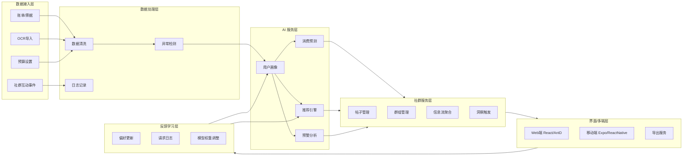
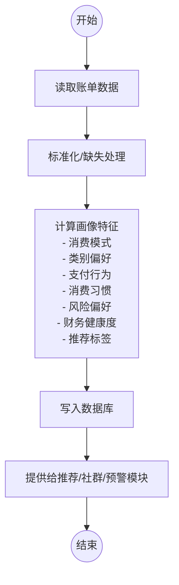
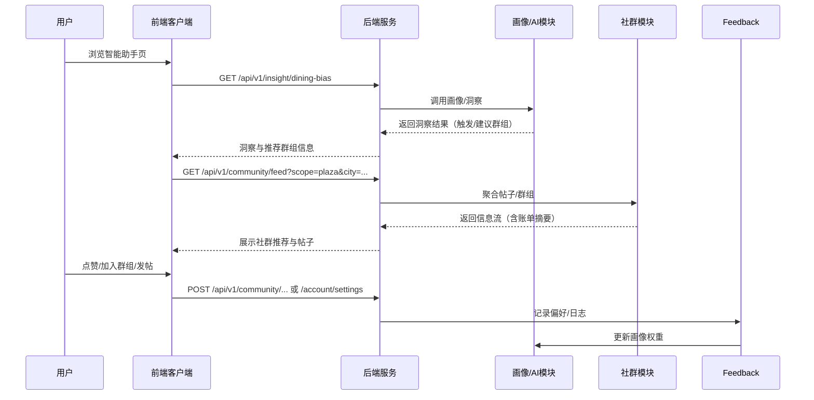

# 附图说明（润色稿）

> 本附图说明对系统架构、用户画像流程、社群联动时序等示意图作文字阐述，并附带 Mermaid 源码以便生成 PNG/SVG 图像。使用时应与说明书正文的图号保持一致。

## 图1 系统总体架构示意图

- 图1 示出系统自数据接入层至反馈学习层的整体结构，体现“画像→社群→反馈”闭环；  
- 箭头标识数据流向，包括接入层、处理层、AI 服务层、社群服务层、界面层及反馈层；  
- `Feedback` 节点回连 `Profiling` 与 `Recommendation`，表明用户行为结果用于迭代画像与推荐策略。

## 图2 用户画像生成流程图

- 图2 示出从原始账单至画像输出的处理流程，强调数据标准化与特征计算；  
- `Features` 节点列出消费模式、类别偏好等核心指标，便于与实施方式对应；  
- `Publish` 节点指示画像结果供推荐、预警及社群模块调用。

## 图3 社群联动时序图

- 图3 描述用户在智能助手界面触发洞察、接收社群推荐并回传反馈的全过程；  
- 时序包含用户、前端、后端、AI 模块、社群模块与反馈模块六个参与者；  
- 图中标注 `/insight/dining-bias`、`/community/feed`、`/community/posts`、`/account/settings` 等关键接口，便于与接口附录交叉引用。

## 图4 异常检测与解释示意图（建议补充）

- 建议在正式文件中补充图4，其横轴可表示时间或账单编号，纵轴表示消费金额；  
- 图中宜标注均值线及阈值线（如均值 + 2.5σ），突出异常点，并在右侧列出异常商家或类别贡献排名；  
- 可直接采用系统导出的图形或重新绘制的统计图。

## 图5 移动端界面结构示意图（建议补充）

- 建议使用线框图展示移动端底部导航（仪表盘、账单、助手、社群、我的）；  
- 图中应标注趋势图卡片、预算预警提示、社群推荐卡及主要操作按钮等组件；  
- 可与“截图与附件”章节配合，说明移动端交互流程。

