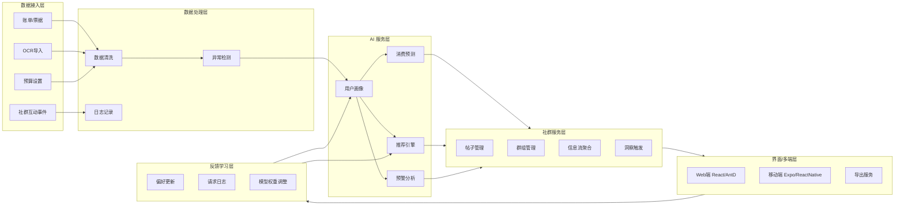
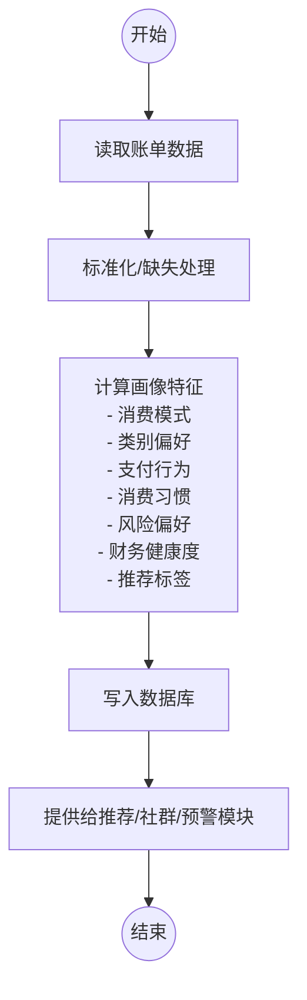
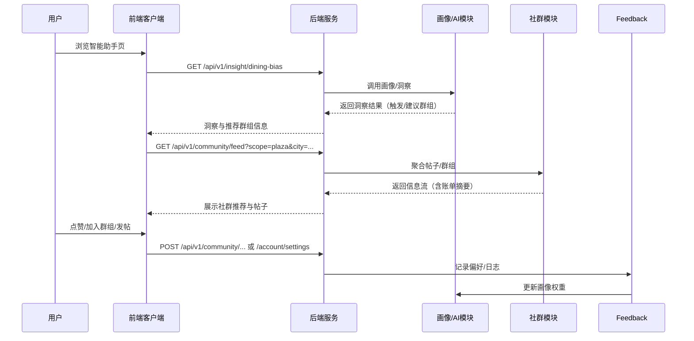

# 一种智能账单画像驱动的社群联动预警系统及方法（润色稿）

> 注：本说明书参考现有系统类发明专利的写作体例，对原始草案进行语言规范化与精炼处理。文中“本发明”“所述系统”均指智能账单画像驱动的社群联动预警平台。

## 一、技术领域

本发明属于智能财务管理与消费行为分析技术领域，尤其涉及一种基于账单数据构建用户画像并驱动社群联动与风险预警的系统及方法，可应用于个人理财、小微企业费用管理以及金融机构客户运营等场景。

## 二、背景技术

### 2.1 传统解决方案的局限

随着移动支付与线上消费的普及，用户账单呈现多渠道、碎片化、高频率等特征。现有账单管理或理财应用通常仅具备分类统计、图表展示、预算提醒等基础能力，仍存在以下不足：

1. **画像维度有限**：多数产品仅输出消费总额或类别占比，难以刻画消费习惯、风险承受度、财务健康度等多维指标；
2. **风险预警不足**：异常检测多依赖固定阈值，欠缺异常来源、贡献度等解释信息，用户难以理解预警原因并及时应对；
3. **社群与数据割裂**：理财或消费社群以静态内容为主，无法依据真实账单画像自动推荐群组或活动，互动粘性不足；
4. **缺乏反馈闭环**：即便提供推荐功能，也缺少将用户行为反馈至画像与策略的机制，优化难以持续。

### 2.2 现有技术参考与不足

现有电子发票分析、工程质量预警等系统虽涵盖数据清洗、指标计算及预警推送，但多聚焦特定行业流程，尚未将用户画像与社群互动协同应用。在个人及小微财务场景中，仍缺少能够实现“画像—洞察—社群—反馈”闭环的综合性技术方案。为此，有必要提出新的系统及方法以弥补上述不足。

## 三、发明内容

### 3.1 发明目的

本发明旨在提供一种智能账单画像驱动的社群联动预警系统及方法，通过统一数据平台与 AI 模块，实现以下目标：

- 构建包含消费模式、类别偏好、支付行为、消费习惯、风险承受度、财务健康度等多维指标的用户画像；  
- 基于画像执行消费趋势预测、预算评估、异常检测，并输出可解释的预警信息；  
- 将洞察结果与社群群组、主题活动、金融产品联动推荐，形成高关联度互动体验；  
- 收集用户在社群中的反馈行为，反向更新画像权重与推荐策略，形成闭环优化；  
- 支撑 Web、移动端及云部署，并提供导出能力，方便报表及合规用途。

### 3.2 技术方案概述

本发明系统包括数据接入层、数据处理层、AI 服务层、社群服务层、界面层和反馈学习层，具体流程如下：

1. **数据采集与清洗**：采集账单、票据、预算、社群事件等多源数据；执行金额异常识别、重复交易检测、字段标准化，生成可用数据集。  
2. **画像生成**：使用 `UserProfiler` 模块对清洗后的数据计算消费模式、类别偏好、支付行为、消费习惯、风险偏好、财务健康度、推荐标签等指标，并存储至数据库。  
3. **预测与预警**：利用 `IntelligentAnalyzer` 模块进行趋势预测、预算评估、异常检测，输出阈值、贡献度等解释信息。  
4. **社群联动**：通过 `RecommendationEngine` 模块，把画像标签与群组主题、帖子内容、活动信息匹配，按城市、可见范围过滤后推送给用户。  
5. **反馈学习**：记录点赞、评论、加入群组、导出申请等行为，将其写入 `user_preferences` 与日志表，按规则调整标签权重、策略阈值。  
6. **多端呈现与导出**：在 Web、移动端展示趋势图、洞察卡片、预警列表，支持导出 Excel、长图用于申报或审计。

### 3.3 有益效果

与现有技术相比，本发明至少具备以下有益效果：

1. **闭环联动**：实现“画像→洞察→社群→反馈”的闭环，动态优化用户体验与运营效果。  
2. **可解释预警**：输出阈值、商家贡献度、类别贡献度等信息，帮助用户快速定位风险并采取措施。  
3. **多场景适配**：既能服务个人理财，也可扩展到企业费用管理、金融机构客户经营，具有良好的扩展性。  
4. **合规可维护**：数据库设计支持偏好记录、导出/注销申请，便于满足数据合规要求。  
5. **跨平台友好**：支持 Web、移动端、云部署，移动端预留 Expo/React Native 实施方案，实现一致体验。

## 四、附图说明

为助于理解本发明，附图包括但不限于：

- 图1：智能账单画像驱动社群联动预警系统总体架构示意图；  
- 图2：用户画像生成流程图；  
- 图3：社群联动与反馈时序图；  
- 图4：异常检测与解释输出示意（可选）；  
- 图5：移动端核心界面结构示意（可选）。

## 五、具体实施方式

以下结合附图及实施例对本发明作进一步说明。应理解，实施例仅用于阐释本发明技术方案，而非对本发明保护范围的限制。

### 5.1 系统架构与部署

如图1所示，本发明系统可部署于云服务器或企业私有云环境，主要包括：

（1）数据接入层，用于提供账单录入、批量导入及光学字符识别（OCR）上传接口，并支持预算配置、通知偏好、社群事件数据的接入，同时预留与支付平台和银行流水系统的对接能力；

（2）数据处理层，用于执行字段统一、缺失值补齐及数据质量评分，采用三σ或箱形图方法识别异常金额，并基于商家与金额组合识别重复记录；处理日志可用于后续审计追溯；

（3）AI 服务层，用于调用 `UserProfiler` 生成用户画像，使用 `RecommendationEngine` 计算匹配评分，并由 `IntelligentAnalyzer` 完成趋势预测、预算评估及异常检测；该层依托 Pandas、NumPy、scikit-learn 等组件，并支持参数配置与热更新；

（4）社群服务层，用于提供帖子、群组、信息流及洞察触发接口，支持帖子附带账单摘要，群组按照城市、类型、级别分类并统计成员数据；

（5）界面呈现层，用于在 Web 端（基于 React、Ant Design、Recharts）和移动端（基于 Expo、React Native、NativeBase、Victory 图表）展示数据，并向导出服务输出 Excel 或长图；

（6）反馈学习层，用于记录 `user_preferences`、`user_request_logs` 等偏好信息及操作申请，通过行为日志触发权重调整，并以周度衰减保持画像灵敏度。

### 5.2 数据清洗与异常检测流程

在一个优选实施例中，数据清洗与异常检测可包括步骤 S201 至 S203：

S201：对用户账单金额序列计算均值与标准差，将均值加 2.5σ 设定为默认异常阈值，超过阈值的记录标记为大额异常；

S202：按商家、金额与日期聚合账单记录，若同日存在多条相同记录，则提示可能的重复记账或异常扣费；

S203：统计缺失字段、格式错误及时间异常等问题，形成数据质量报告，为后续模型训练与审计提供依据。

### 5.3 用户画像生成流程

用户画像生成流程可包括步骤 S301 至 S308：

S301：获取近 1000 条账单数据并转换为 DataFrame，同时统一时间与金额格式；

S302：计算消费模式指标，包括总金额、平均金额、标准差、消费类型等级及变异系数；

S303：统计类别偏好，输出 TOP3 类别金额占比及多样性评分；

S304：分析支付行为，识别主支付方式及使用频次；

S305：评估消费习惯，包括日均频次、主要消费时段及周度一致性；

S306：计算风险偏好，关注金额波动、最大单笔金额及类别多样性；

S307：综合计算财务健康度，对消费合理性、多样性、稳定性等指标加权，并生成高消费、餐饮偏好、微信支付等推荐标签；

S308：将画像结果写入 `user_profiles` 表，并向推荐、预警及社群模块开放调用接口。

### 5.4 预测与预警模块

预测与预警模块可包括步骤 S401 至 S404：

S401：根据 period（日、周、月、年或全部）选择相应的移动平均窗口（例如日/周为 3、月为 6、年为 3），输出预测结果及 MAPE 指标；

S402：结合 `budgets` 表统计当月预算使用率，若超过预设阈值（默认 80%），生成预算预警并提示剩余额度；

S403：输出异常交易列表，同时统计异常商家及类别的出现频次，形成解释信息；

S404：按照平衡 0.3、稳定 0.3、预算 0.25、异常 0.15 的权重计算财务健康分，并返回分项指标。

### 5.5 社群联动机制

社群联动机制可包括步骤 S501 至 S504：

S501：当餐饮消费占比不低于 35%、领先第二大类别不少于 20%、且交易次数不少于 10 时，通过 `insight_dining_bias` 接口触发同城餐饮相关群组推荐；

S502：通过 `community_feed` 接口按 scope、city、group_id、visibility 聚合帖子与群组信息，并对附带账单的帖子附加摘要；

S503：将用户画像标签与社群主题计算匹配度，得分大于 0.3 的条目进入推荐队列；

S504：记录点赞、评论、加入群组等行为，每次按预设增量更新标签权重，并以周度 5% 的衰减系数维持画像与用户行为的一致性。

### 5.6 多端实现

多端呈现可包括以下实施方式：

（1）Web 端：在智能助手页面通过 Segmented 控件提供日/周/月/年/全部维度切换，展示趋势图、健康评分与异常提示；在账单页面提供 Excel 及长图导出；在个人中心支持通知配置、数据导出及注销申请；

（2）移动端：基于 Expo Router 构建模块化导航，按照自定义主题展示趋势、预算预警及社群推荐，支持离线缓存与下拉刷新，并可直接提交导出请求或参与社群活动。

### 5.7 实施例

实施例一（个人用户场景）：用户在 Web 端导入银行卡账单，系统生成画像并展示消费趋势及健康评分。当餐饮消费占比高于阈值时，系统推送“上海餐饮节约群”，用户点赞或加入群组后，反馈日志更新画像标签权重，后续推荐更加精准。

实施例二（家庭共享场景）：多名家庭成员共享账户录入账单，系统依据预算配置监控类别支出。当“教育”类别使用率超过 80% 时触发预警并推荐“家长教育交流”群，导出的长图可用于家庭预算会审。

实施例三（小微企业场景）：企业财务导入报销数据，系统识别异常大额交易并输出商家贡献度报告。社群模块推送“采购联盟”群组及相关金融产品，导出的 Excel 与长图用于内部审计存档。

实施例四（移动端应用场景）：用户通过移动应用查看仪表盘并接收预算预警推送，点击社群推荐后加入活动，相关行为同步至后端，画像权重及通知偏好据此更新，用户亦可在移动端发起数据导出或注销申请。

## 六、权利要求书（润色稿）

### 权利要求1（系统）

一种智能账单画像驱动的社群联动预警系统，其特征在于，包括：

A. 数据接入与清洗模块，用于接收账单、票据、预算及社群事件数据，并执行金额异常识别、重复交易检测、字段标准化，生成清洗后的账单数据集；

B. 画像分析模块，用于基于所述清洗后的账单数据集计算消费模式、类别偏好、支付行为、消费习惯、风险承受度、财务健康度以及推荐标签，生成用户画像并存储；

C. 预测预警模块，用于依托所述用户画像执行消费趋势预测、预算使用率评估、金额异常检测，并输出包含阈值、商家与类别贡献度的预警信息；

D. 社群联动模块，用于根据所述用户画像和所述预警信息匹配社群群组、帖子或活动内容，按城市、可见范围筛选并推送，且支持帖子附带账单摘要；

E. 反馈学习模块，用于记录用户在所述社群联动模块中的互动行为，并基于所述互动行为更新所述用户画像及推荐策略；

F. 多端呈现模块，用于在客户端展示趋势图、画像指标、预警信息及社群内容，并提供账单数据的 Excel 与长图导出。

### 权利要求2（从属）

根据权利要求1所述系统，其中所述画像分析模块生成的消费模式包含总金额、平均金额、变异系数、消费类型等级；风险承受度基于金额波动系数及单笔最大金额计算；财务健康度基于消费合理性、多样性、稳定性加权得到。

### 权利要求3（从属）

根据权利要求1所述系统，其中所述预测预警模块以均值 + 2.5σ 作为金额异常阈值，并对异常记录的商家与类别进行频次统计，生成解释信息。

### 权利要求4（从属）

根据权利要求1所述系统，其中所述社群联动模块在检测到餐饮消费占比超过预设阈值且领先第二大类别时，优先推荐与餐饮节约相关的同城群组，并在信息流中突出展示。

### 权利要求5（从属）

根据权利要求1所述系统，其中所述反馈学习模块对点赞、评论、加入群组等行为按照预设增量调整推荐标签权重，并按周期执行衰减以保持画像灵敏度。

### 权利要求6（方法）

一种智能账单画像驱动的社群联动预警方法，包括：

(1) 采集并清洗账单数据，执行金额异常识别与重复交易检测；

(2) 计算消费模式、类别偏好、支付行为、消费习惯、风险承受度、财务健康度等指标，生成用户画像；

(3) 基于所述用户画像进行消费趋势预测、预算使用率评估、金额异常检测，输出预警信息；

(4) 根据所述预警信息与所述用户画像匹配社群内容并推送给用户；

(5) 记录用户对所述社群内容的互动行为，并根据所述互动行为更新所述用户画像与推荐策略。

### 权利要求7（从属）

根据权利要求6所述方法，其中步骤(4)包括在社群帖子中附加账单摘要信息，以提升内容解释度并促进互动。

### 权利要求8（从属）

根据权利要求6所述方法，其中步骤(5)对互动行为设置权重增量，并在每周按固定比例衰减，以保持画像对最新行为的敏感度。

### 权利要求9（装置）

一种用于执行权利要求6所述方法的智能账单画像驱动社群联动预警装置，包括存储器、处理器及存储在所述存储器中并可在所述处理器上运行的程序，所述程序被执行时实现权利要求6中所述的各步骤。

### 权利要求10（从属）

根据权利要求9所述装置，其中所述程序还包括移动端客户端模块，通过 Expo/React Native 框架实现仪表盘、账单中心、智能助手、社群互动及个人中心页面。

> 以上实施例用于说明本发明，不应理解为对本发明的限定。所属领域的技术人员在不脱离本发明精神和范围的情况下，可作出各种改动或替换，均应落入本发明的保护范围。


# 附图说明（扩展草案）

> 本文提供系统架构、用户画像流程、社群联动时序等附图的详细说明及 Mermaid 源码。实际提交时，可将源码导出为 PNG/SVG，并配合说明书正文引用图号。

## 图1 系统总体架构示意图

- 展示从数据接入层到反馈学习层的整体模块划分，体现“画像→社群→反馈”闭环。  
- 箭头指示数据流向：接入层 → 处理层 → AI 服务层 → 社群服务层 → 界面层 → 反馈层。  
- `Feedback` 模块回连 `Profiling`、`Recommendation`，强调用户行为回写机制。



## 图2 用户画像生成流程图

- 说明从原始账单到画像输出的关键步骤，强调数据清洗和特征计算的重要性。  
- `Features` 节点列出主要画像指标，便于与实施例对应。  
- `Publish` 节点表示画像提供给推荐、预警、社群模块使用。



## 图3 社群联动时序图

- 描述用户在智能助手页面操作后触发洞察、社群推荐、行为反馈的全过程。  
- 时序包含用户、前端、后端、AI 模块、社群模块、反馈模块六个参与者。  
- 标注关键 API：`/insight/dining-bias`、`/community/feed`、`/community/posts`、`/account/settings` 等，便于与接口附录交叉引用。



## 图4 异常检测与解释示意图（建议补充）

- 建议在实际文件中展示：  
  - 横轴：时间或账单编号；纵轴：消费金额。  
  - 标注均值线、阈值线（均值 + 2.5σ），突出异常点。  
  - 右侧列表展示异常记录对应的商家/类别贡献 Top3。  
- 可使用实际系统导出的图形或重新绘制的统计图。

## 图5 移动端界面结构示意图（建议补充）

- 建议绘制移动端底部 Tab（仪表盘、账单、助手、社群、我的）的线框图。  
- 在图中标注关键组件：趋势图卡片、预算预警提示、社群推荐卡、操作按钮等。  
- 可作为“截图与附件”章节的补充，配合文字说明移动端交互流程。


# 附录：数据库、接口与算法参数（润色稿）

本附录对本发明实施例涉及的数据库结构、接口定义及算法参数进行补充说明，以便于理解系统实现细节。

## A. 数据库表结构

### 表 A1 `users`
- `id` (INTEGER, PK)
- `username` (VARCHAR, 唯一)
- `email` (VARCHAR)
- `hashed_password` (VARCHAR)
- `created_at` (DATETIME)

### 表 A2 `bills`
- `id` (INTEGER, PK)
- `user_id` (INTEGER, FK → `users.id`)
- `consume_time` (DATETIME)
- `amount` (DECIMAL(12,2))
- `merchant` (VARCHAR)
- `category` (VARCHAR)
- `payment_method` (VARCHAR)
- `city` (VARCHAR)
- `note` (TEXT)
- `created_at` (DATETIME)
- `source` (VARCHAR) — web / mobile / import 标记来源渠道

### 表 A3 `budgets`
- `id` (INTEGER, PK)
- `user_id` (INTEGER, FK)
- `category` (VARCHAR)
- `monthly_budget` (DECIMAL(12,2))
- `alert_threshold` (DECIMAL(5,2)) — 超限比例，默认 0.8
- `created_at` (DATETIME)

### 表 A4 `user_profiles`
- `id` (INTEGER, PK)
- `user_id` (INTEGER, FK)
- `spending_pattern` (JSON)
- `risk_tolerance` (VARCHAR) — conservative/moderate/aggressive
- `investment_preference` (JSON) — 类别偏好等
- `updated_at` (DATETIME)

### 表 A5 `user_preferences`
- `id` (INTEGER, PK)
- `user_id` (INTEGER, 唯一)
- `city` (VARCHAR)
- `job` (VARCHAR)
- `budget_cycle` (VARCHAR) — daily/weekly/monthly
- `notify_budget` (BOOLEAN)
- `notify_insight` (BOOLEAN)
- `notify_community` (BOOLEAN)
- `updated_at` (DATETIME)

### 表 A6 `user_request_logs`
- `id` (INTEGER, PK)
- `user_id` (INTEGER, FK)
- `request_type` (VARCHAR) — export/deactivate
- `status` (VARCHAR) — pending/done/rejected
- `detail` (TEXT)
- `created_at` (DATETIME)

### 表 A7 `community_posts`
- `id` (INTEGER, PK)
- `user_id` (INTEGER, FK)
- `title` (VARCHAR)
- `content` (TEXT)
- `bill_id` (INTEGER, FK → `bills.id`, 可空)
- `invoice_id` (INTEGER, 可空)
- `group_id` (INTEGER, 可空)
- `visibility` (VARCHAR) — public/same_city/private
- `attached_bill_id` (INTEGER)
- `location_city` (VARCHAR)
- `likes_count` (INTEGER)
- `comments_count` (INTEGER)
- `created_at` (DATETIME)
- `updated_at` (DATETIME)

### 表 A8 `groups`
- `id` (INTEGER, PK)
- `name` (VARCHAR)
- `level` (VARCHAR) — national/provincial/city
- `province` (VARCHAR)
- `city` (VARCHAR)
- `district` (VARCHAR)
- `type` (VARCHAR) — catering/finance/parenting 等
- `cover_url` (VARCHAR)
- `description` (TEXT)
- `created_at` (DATETIME)
- `max_members` (INTEGER, 默认 1000)

### 表 A9 `group_members`
- `id` (INTEGER, PK)
- `group_id` (INTEGER, FK → `groups.id`)
- `user_id` (INTEGER, FK)
- `joined_at` (DATETIME)
- `role` (VARCHAR) — owner/admin/member

### 表 A10 `financial_products`
- `id` (INTEGER, PK)
- `product_name` (VARCHAR)
- `product_type` (VARCHAR)
- `interest_rate` (DECIMAL(5,2))
- `min_amount` (DECIMAL(12,2))
- `max_amount` (DECIMAL(12,2))
- `risk_level` (VARCHAR)
- `description` (TEXT)

## B. API 接口说明

### B1 账单相关

| 接口 | 方法 | 必填参数 | 可选参数 | 描述 |
| --- | --- | --- | --- | --- |
| `/api/v1/bills` | GET | `page`, `pageSize` | `category`, `merchant`, `dateRange`, `minAmount`, `maxAmount` | 查询账单（分页、筛选） |
| `/api/v1/bills` | POST | `consume_time`, `amount` | `merchant`, `category`, `payment_method`, `city`, `note`, `source` | 创建账单 |
| `/api/v1/bills/{id}` | PUT | `id` | 与 POST 字段一致 | 更新账单 |
| `/api/v1/bills/{id}` | DELETE | `id` |  | 删除账单 |
| `/api/v1/bills/export/excel` | GET | `user_id` | `from`, `to`, `category` | 导出 Excel |
| `/api/v1/bills/export/image` | GET | `user_id`, `type` | `period`, `category` | 导出长图（`type`: list/comparison） |

**请求示例（POST /bills）**
```json
{
  "consume_time": "2025-11-09T12:30:00",
  "amount": 128.5,
  "merchant": "盒马鲜生",
  "category": "餐饮",
  "payment_method": "支付宝",
  "city": "上海"
}
```

### B2 智能助手 & 分析

| 接口 | 方法 | 必填参数 | 可选参数 | 描述 |
| --- | --- | --- | --- | --- |
| `/api/v1/analytics/trend` | GET | `period` (day/week/month/year/all) | `user_id`, `category` | 获取趋势数据 |
| `/api/v1/analytics/forecast` | GET | `period`, `horizon` | `user_id`, `category` | 获取趋势预测及误差 |
| `/api/v1/analytics/health-score` | GET | `window_days` | `user_id` | 财务健康评分（含分项） |
| `/api/v1/analytics/anomaly` | GET | `window_days` | `user_id`, `threshold_multiplier`, `limit` | 异常检测结果 |
| `/api/v1/insight/dining-bias` | GET | `user_id` | `city`, `period_days`, `share_threshold` | 餐饮偏好洞察 |
| `/api/v1/ai/profile` | GET | `user_id` |  | 获取用户画像 |

### B3 社群模块

| 接口 | 方法 | 必填参数 | 可选参数 | 描述 |
| --- | --- | --- | --- | --- |
| `/api/v1/community/posts` | GET | `page`, `pageSize` | `group_id`, `keyword`, `visibility` | 帖子列表 |
| `/api/v1/community/posts` | POST | `title`, `content` | `bill_id`, `group_id`, `attached_bill_id`, `visibility`, `city` | 创建帖子，可附账单摘要 |
| `/api/v1/community/posts/{id}/like` | POST | `id`, `user_id` | | 点赞 |
| `/api/v1/community/posts/{id}/comments` | POST | `id`, `user_id`, `content` | | 评论 |
| `/api/v1/community/feed` | GET | `scope` | `city`, `group_id`, `visibility`, `limit`, `offset` | 信息流聚合 |
| `/api/v1/groups` | GET |  | `city`, `type`, `level`, `q`, `limit`, `offset` | 群组列表 |
| `/api/v1/groups/{id}` | GET | `id` | `user_id` | 群组详情（含是否已加入） |
| `/api/v1/groups/{id}/join` | POST | `id`, `user_id` | | 加入群组 |
| `/api/v1/groups/{id}/leave` | POST | `id`, `user_id` | | 退出群组 |

### B4 个人中心 / 偏好

| 接口 | 方法 | 必填参数 | 可选参数 | 描述 |
| --- | --- | --- | --- | --- |
| `/api/v1/account/settings` | GET | `user_id` | | 获取偏好配置 |
| `/api/v1/account/settings` | PUT | `user_id` | `city`, `job`, `budget_cycle`, `notify_budget`, `notify_insight`, `notify_community` | 更新偏好 |
| `/api/v1/account/export` | POST | `user_id` | `reason`, `date_range` | 申请账单导出 |
| `/api/v1/account/deactivate` | POST | `user_id` | `reason`, `schedule_date` | 申请账号注销 |

**请求示例（PUT /account/settings）**
```json
{
  "city": "上海",
  "job": "产品经理",
  "budget_cycle": "monthly",
  "notify_budget": true,
  "notify_insight": true,
  "notify_community": false
}
```

## C. 核心算法参数

### C1 用户画像
- `spending_pattern.level`：阈值 5000 / 10000（低/中/高消费水平）
- `spending_pattern.stability`：变异系数阈值 0.5（稳定）、1.0（波动）
- `category_preference.prefer_level`：类别金额占比阈值 10% / 30%
- `consumption_habits.frequency`：日均次数阈值 1 / 3
- `consumption_habits.consistency`：周度金额稳定度阈值 0.4 / 0.7
- `risk_profile`：金额波动系数 >1.0 且单笔>均值3倍判定 aggressive
- `financial_health`：基础分 50，平均金额 <100 +20分，>1000 -20分，多样性>5 +15 分
- `recommendation_tags`：  
  - 总金额 >10000 → `high_spender`  
  - 餐饮占比 >40% → `food_lover`  
  - 微信支付占比 >70% → `wechat_user`

### C2 异常检测
- 均值 + 2.5 σ 作为默认异常阈值，可通过参数 `threshold_multiplier` 动态调整
- 异常比例 ×2 作为扣分因子
- 支持 `limit` 参数控制返回条数，默认输出前 20 条异常记录，并统计类别/商家 Top3

### C3 健康评分
- 综合权重：平衡 0.3、稳定 0.3、预算 0.25、异常 0.15
- 无预算数据时预算基线 0.7

### C4 预测模型
- 移动平均窗口：  
  - 日/周周期取 3  
  - 月周期取 6  
  - 年周期取 3
- MAPE 计算用于评估预测误差，结果写入响应 `mape`

### C5 洞察 & 推荐
- 餐饮偏好触发条件：  
  - `period_days` 默认 90 天  
  - 餐饮占比 ≥ 0.35  
  - 与次高类别差值占比 ≥ 0.2  
  - 交易次数 ≥ 10
- 推荐阈值：推荐评分 > 0.3 方进入结果集，评分由画像标签与产品/社群标签相似度计算。

### C6 反馈学习
- 点赞/评论/加入群组等行为计入偏好日志；默认每次行为增加标签权重 0.05，按周衰减 5%。  
- 行为可配置权重：点赞 0.03、评论 0.05、加入群组 0.08、发布帖子 0.10；衰减系数默认为 0.95。

## D. 接口返回示例

**`GET /api/v1/analytics/anomaly`**
```json
{
  "success": true,
  "data": {
    "anomalies": [
      {
        "id": 1024,
        "consume_time": "2025-10-28 19:21:00",
        "amount": 1899.0,
        "merchant": "Apple Store",
        "category": "数码",
        "dt": "2025-10-28T19:21:00"
      }
    ],
    "threshold": 1220.45,
    "explain": {
      "top_categories": [["数码", 3], ["旅行", 1], ["餐饮", 1]],
      "top_merchants": [["Apple Store", 2], ["国航", 1], ["海底捞", 1]]
    }
  }
}
```

**`GET /api/v1/ai/profile`**
```json
{
  "success": true,
  "data": {
    "user_id": 1,
    "spending_pattern": {"type": "medium_value", "level": "medium", "stability": "moderate"},
    "category_preference": {"top_categories": ["餐饮", "出行", "数码"]},
    "payment_behavior": {"preferred_method": "微信"},
    "consumption_habits": {"frequency": "high", "time_preference": "evening"},
    "risk_profile": {"tolerance": "moderate"},
    "financial_health": {"score": 78, "level": "good"},
    "recommendation_tags": ["food_lover", "wechat_user"]
  }
}
```

## E. 字段与参数补充说明

### E1 关键字段说明表

| 字段 | 类型 | 约束 | 说明 |
| --- | --- | --- | --- |
| `bills.amount` | DECIMAL(12,2) | NOT NULL | 消费金额（元） |
| `bills.source` | VARCHAR | | 数据来源：web/mobile/import |
| `budgets.alert_threshold` | DECIMAL(5,2) | DEFAULT 0.8 | 预算预警比例 |
| `user_profiles.spending_pattern` | JSON | | 存储消费模式细分指标 |
| `community_posts.visibility` | VARCHAR | DEFAULT 'public' | 可见范围（public/same_city/private） |
| `group_members.role` | VARCHAR | DEFAULT 'member' | 成员角色 |

### E2 分析接口参数说明

| 参数 | 所属接口 | 类型 | 默认值 | 说明 |
| --- | --- | --- | --- | --- |
| `period` | `/analytics/trend`, `/analytics/forecast` | STRING | `month` | 时间粒度 |
| `horizon` | `/analytics/forecast` | INTEGER | 1 | 预测期数 |
| `window_days` | `/analytics/health-score`, `/analytics/anomaly` | INTEGER | 90 | 统计窗口天数 |
| `threshold_multiplier` | `/analytics/anomaly` | FLOAT | 2.5 | 异常阈值倍数 |
| `scope` | `/community/feed` | STRING | `plaza` | 信息流范围（plaza/my_groups） |
| `visibility` | `/community/feed` | STRING | `all` | 可见性过滤 |
| `share_threshold` | `/insight/dining-bias` | FLOAT | 0.35 | 餐饮占比触发阈值 |

### E3 算法计算示例

1. **异常阈值计算**  
   - 输入金额序列：\[120, 150, 200, 135, 180, 210, 900\]  
   - 均值 μ = 270.7，标准差 σ ≈ 264.0  
   - 默认阈值 = μ + 2.5σ ≈ 930.7。若用户将 `threshold_multiplier` 调整为 2.0，则阈值 = μ + 2.0σ ≈ 798.7，900 将被标记为异常。  
   - 输出异常列表同时统计商家/类别贡献 Top3。

2. **健康评分示例**  
   - 平衡度 0.82、稳定度 0.75、预算得分 0.65、异常得分 0.90  
   - Score = (0.82×0.3 + 0.75×0.3 + 0.65×0.25 + 0.90×0.15) × 100 ≈ 78.8，健康等级为 `good`。

3. **反馈权重更新**  
   - 当周行为：点赞 3 次、评论 1 次、加入群组 1 次  
   - 增量 = 3×0.03 + 1×0.05 + 1×0.08 = 0.20  
   - 若上周标签权重为 0.60，则衰减后为 0.60×0.95 = 0.57，再加增量得到 0.77，写回 `user_preferences`。

